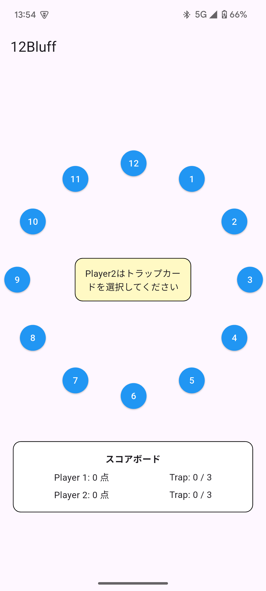

#  12Bluff - 心理戦カードゲーム

Flutter製のWebブラウザで遊べる心理戦ゲームです。  
攻守交代制で12枚のカードを取り合い、先に40点を獲得するか、相手にトラップを3回踏ませれば勝利！

 

##  デモページ

[GitHub Pagesでプレイ](https://taketyan-man.github.io/12Bluff/)

---

##  ルール概要

- 1〜12のカードから交互にカードを選び合います
- 毎ターン、守り手は1枚だけ「トラップカード」を仕込みます
- 攻め手がトラップを選ぶとスコアが0にリセット、かつトラップ回数が1加算されます
- トラップを3回踏む、もしくは40点以上獲得、またはカードが残り1枚になったら終了

---

##  使用技術

- Flutter 3.29.3
- Dart 3.7.2
- GitHub Pages（Webデプロイ）

---

##  感想
こちらは以前テレビ番組で見たゲームを自分もやってみたいと思い、作成してみました。
今後やってみたいこととしては、今はその場に二人いなければ遊べないので、オンライン対戦機能や、
AIとの対戦モードや、 UIをもっと綺麗にしていきたいとおもました。今はAndroidのみでUIデザインを作成したので今後のアプデートで直していきます。

##  追加情報

